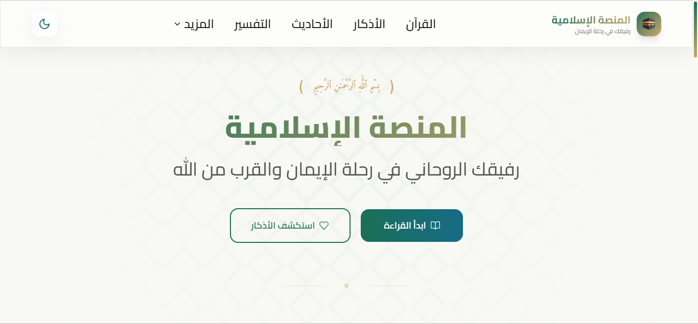
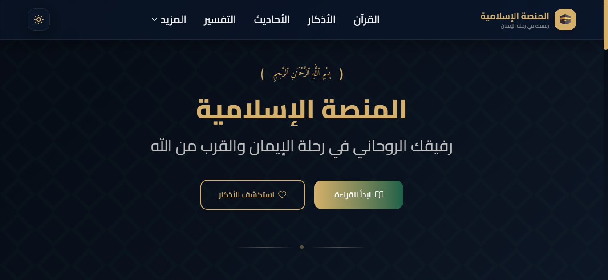
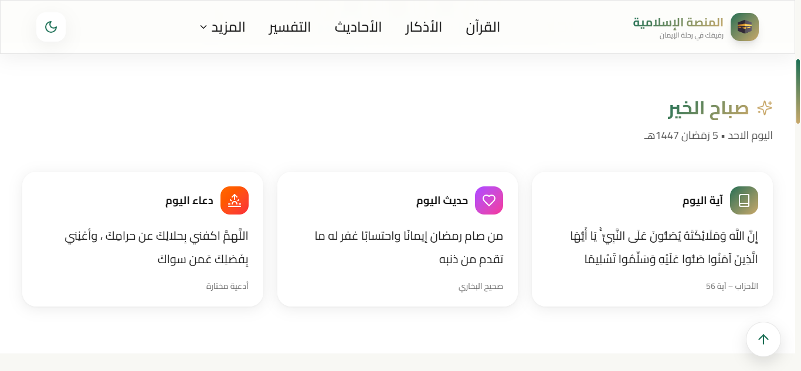
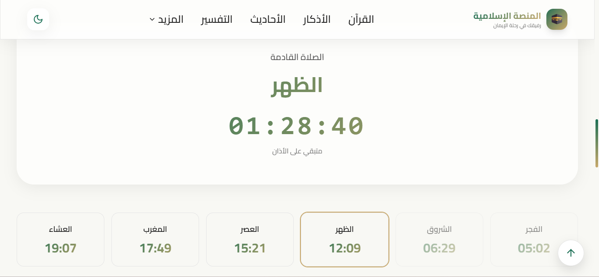
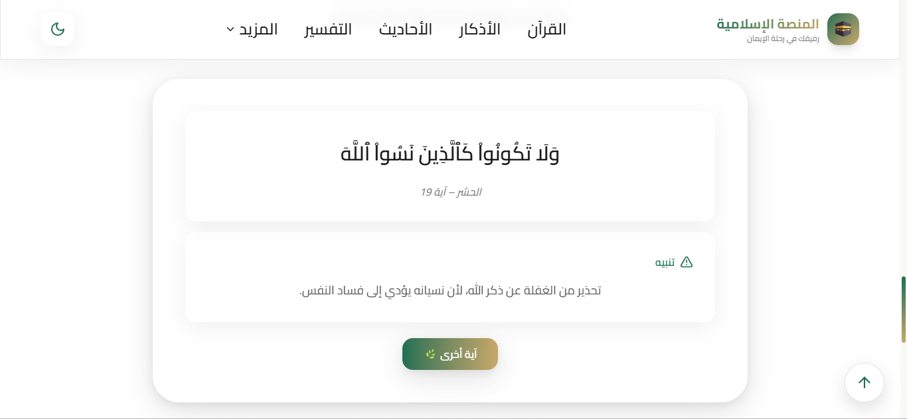
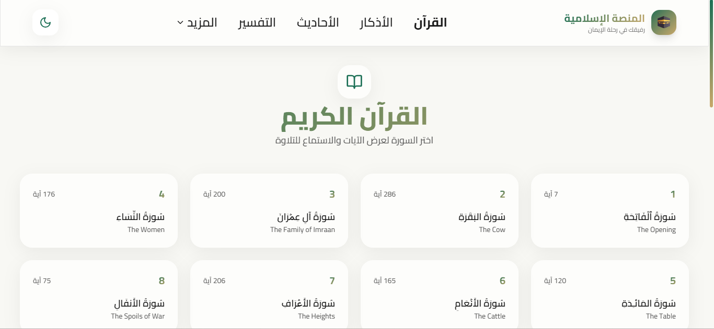
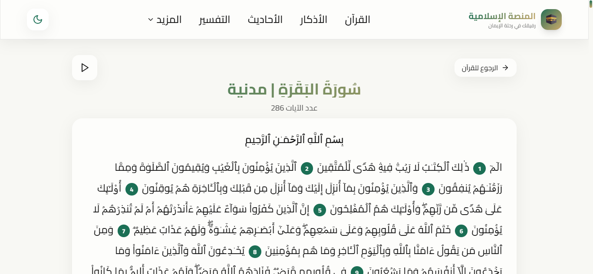
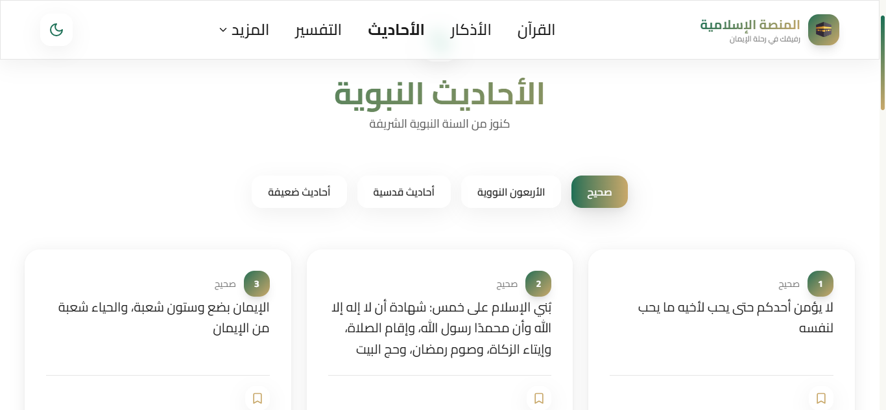
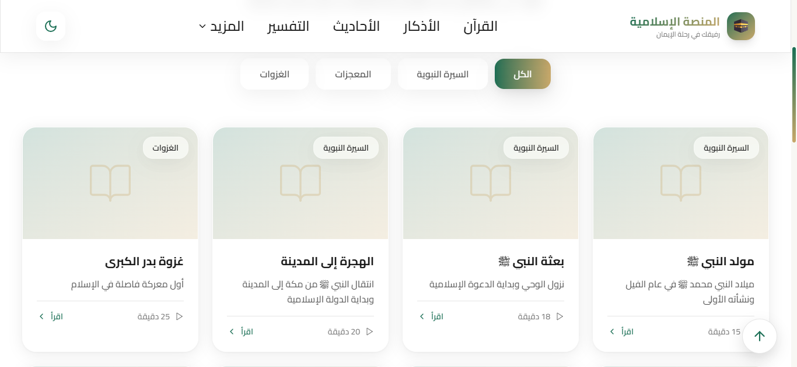
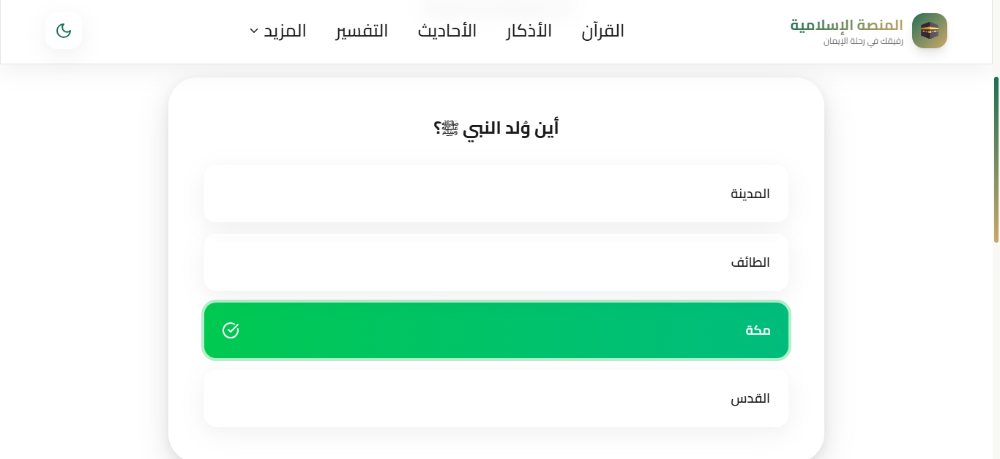

# المنصة الإسلامية | Islamic Platform

## 📸 Screenshots

<!-- All images full width -->

  

  

  

  

  

  

  

  

  

  

---

## 🌟 Features

- **Quran** 
- **Hadith** 
- **Azkar**
- **Tafsir** 
- **Seerah**
- **99 Names of Allah**  
- **Zakat Calculator**  
- **Fatawa Section**  
- **Interactive Islamic Tests**  
- **Prayer Timings**  
- **Daily Quran Message**

---

## 🛠️ Built With

- **React** – Front-End Library for building UI components  
- **Vite** – Fast development build tool  
- **TypeScript** – Type-safe JavaScript  
- **Tailwind CSS** – Utility-first CSS framework for styling  
- **Lucide React** – Icon library for React  
- **Responsive Design** – Works on mobile and desktop  
- **Integration with multiple Islamic APIs** – For Quran, Hadith, Azkar, Prayer Timings, etc.

---

## 👥 Contributors

- **Eng. Ahmed Talaat** – Front-End Developer  
- **Eng. Abdullah Saad** – Front-End Developer  

---

## 🔗 Website

[المنصة الإسلامية](https://al-manasah.vercel.app/)
